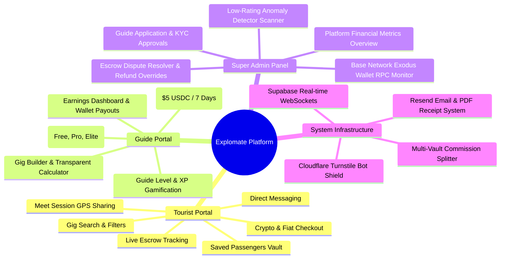
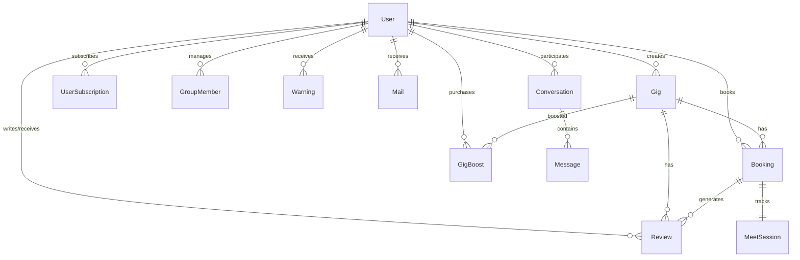
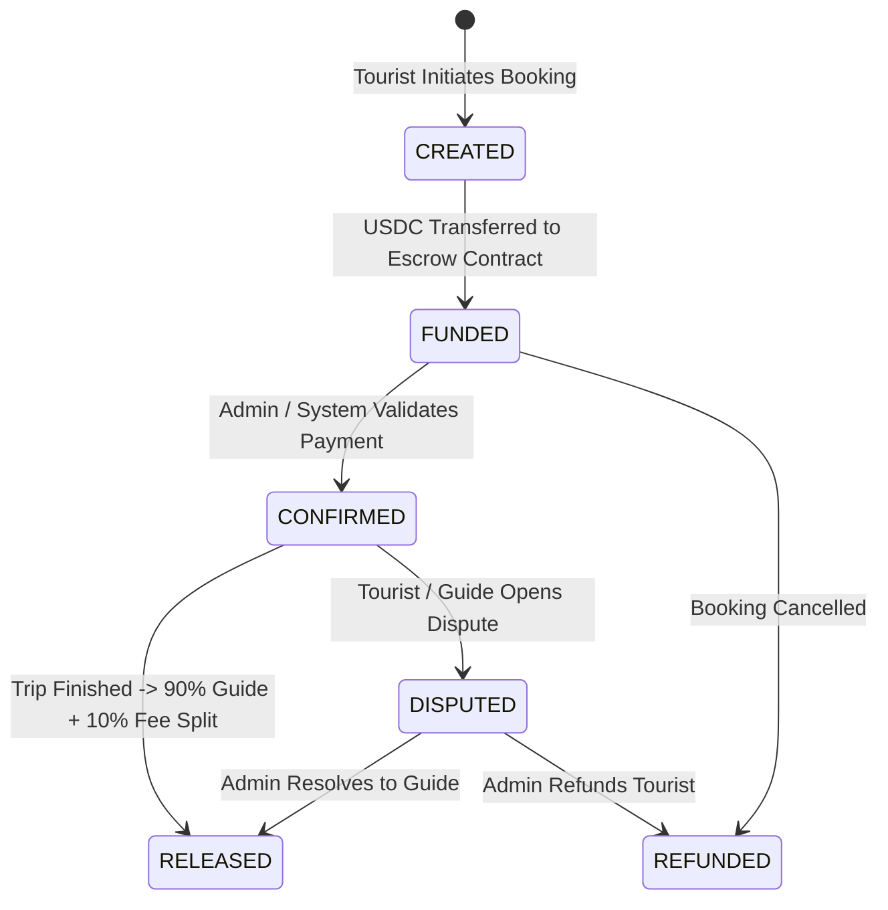

# Explomate Platform - Full Feature & Code Architecture Report

This report presents a comprehensive technical audit, full feature breakdown, database schema specification, smart contract design, algorithmic model, and complete code architecture for the **Explomate Platform** — a Web3 decentralized tourism marketplace and automated escrow system built on Ethereum Layer-2 (Base Network).

---

## 1. Executive Summary & Core Platform Overview

**Explomate** connects global travelers (tourists) directly with vetted local tour guides. By replacing traditional high-fee payment processors (which charge 2.9% - 15% in processing and intermediary fees) with decentralized EVM smart contract escrows on the **Base Network**, Explomate delivers micro-gas transactions (~$0.01 per booking), non-custodial financial security, and automated earnings releases.

### Key Value Propositions
1. **Non-Custodial Escrow**: Tourist payments are locked in smart contract escrows (`ExplomateEscrow.sol`). Funds are never held in custodial platform wallets.
2. **Transparent Fee & Treasury Split Engine**: 90% of booking fees flow directly to local guides, while the 10% platform commission is atomically split into Gas/Ops, Growth, and Dividend vaults.
3. **Anti-Pay-To-Win Discoverability**: A multi-factor ranking algorithm ensures that guide quality and ratings remain the primary search ranking factors over paid subscriptions.
4. **Instant Verification & Safety**: Cloudflare Turnstile bot protection, identity document verification, automated anomaly rating scanners, and real-time GPS meet-up sessions ensure high safety standards.

---

## 2. System Architecture & Tech Stack

```mermaid
graph TD
    Client[Web Client / Mobile Browser]
    
    subgraph Frontend & App Router ["Next.js 14 App Router (TypeScript + Tailwind CSS)"]
        UI[React UI Components / Glassmorphism]
        ClientState[NextAuth Session / Web3 Ethers.js Wallet Provider]
    end
    
    subgraph API Layer ["Next.js Server API Routes (/api)"]
        AuthAPI[Auth & Captcha Handler]
        GigAPI[Gig & Discoverability Service]
        BookingAPI[Booking & Meet Engine]
        PaymentAPI[Web3 Payment / Escrow Relayer]
        AdminAPI[Admin & Dispute Resolution Engine]
    end
    
    subgraph Security & Services ["External & Security Infrastructure"]
        Turnstile[Cloudflare Turnstile Captcha]
        Resend[Resend API - Email & PDF Generator]
        Supabase[Supabase Real-Time WebSocket Messaging]
    end

    subgraph Data & Blockchain Layer ["Storage & Blockchain Infrastructure"]
        Prisma[(Prisma ORM)]
        Postgres[(PostgreSQL Database)]
        BaseEVM[Base L2 EVM Smart Contract: ExplomateEscrow.sol]
    end

    Client --> UI
    UI --> ClientState
    ClientState --> API Layer
    AuthAPI --> Turnstile
    BookingAPI --> Resend
    UI --> Supabase
    API Layer --> Prisma
    Prisma --> Postgres
    PaymentAPI --> BaseEVM
```

### Technology Stack Matrix
- **Core Framework**: [Next.js 14](https://nextjs.org/) (App Router, Server Actions, API Routes) with TypeScript.
- **Styling & UI**: [Tailwind CSS](https://tailwindcss.com/) with customized dark-mode HSL design system, responsive card grids, and smooth micro-animations.
- **Database & ORM**: [Prisma ORM](file:///c:/Users/Rayhan/Music/explomate.ly/prisma/schema.prisma) with PostgreSQL database.
- **Authentication**: NextAuth.js (supporting credentials, Google OAuth, and JWT session handling).
- **Blockchain Smart Contracts**: Solidity `^0.8.20`, OpenZeppelin Contracts (`SafeERC20`, `ReentrancyGuard`, `Ownable`), compiled via Hardhat, deployed on Base Network L2.
- **Web3 Integration**: Ethers.js v6 with browser wallet providers (MetaMask, Coinbase Wallet).
- **Real-Time Communications**: Supabase JS SDK (WebSocket channels for instant chat messaging).
- **Email & PDF Generation**: Resend API integration with programmatic PDF invoice generation via `jspdf`.
- **Bot Defense**: Cloudflare Turnstile Captcha integrated into user authentication flows.

---

## 3. Full Feature Architecture Breakdown

Explomate features role-based access control (RBAC) separated across three primary user roles: **Tourist**, **Guide**, and **Super Admin**.



### 3.1 Tourist Portal Features
1. **Dynamic Search & Filtering**: Filter tours by location, price, rating, duration, category, and language. Sorted by default via the multi-factor `ranking_score`.
2. **Transparent Checkout**: Instant USDC/USDT price conversion with breakdown of total costs.
3. **Escrow Booking Execution**: Tourist locks funds directly into the smart contract escrow upon checkout.
4. **Trip Progress & GPS Proof-of-Meet**: Live session component ([meet-session.tsx](file:///c:/Users/Rayhan/Music/explomate.ly/components/meet/meet-session.tsx)) enabling real-time location sharing and arrival status verification between tourist and guide.
5. **Saved Passengers Vault**: Manage group passenger details (`GroupMember` table: passport numbers, IDs, birth dates) to enable one-click checkout for group tours.
6. **Direct Messenger**: Instant WebSocket chat with guide before and during bookings.
7. **Reviews & Rating**: Submit star ratings and feedback upon trip completion.

### 3.2 Local Guide Portal Features
1. **Gig Management & Transparent Fee Calculator**: When creating or editing a gig, the guide enters their desired net earnings (`guide_price`). The system automatically computes:
   $$\text{client\_price} = \frac{\text{guide\_price}}{0.95}$$
   $$\text{platform\_fee} = \text{client\_price} - \text{guide\_price}$$
   Guides see exactly what tourists pay and what Explomate retains before publishing.
2. **Guide Gamification & XP System**: Guides earn XP and increase levels through positive reviews and completed bookings:
   - Level calculation: $\text{Level} = \lfloor \frac{\text{XP}}{100} \rfloor + 1$.
3. **Tiered Guide Subscriptions**:
   - **FREE**: Standard listing, baseline search visibility.
   - **PRO** ($10 USDC/month): Priority ranking boost (1.5x weight), featured badge, enhanced analytics.
   - **ELITE** ($25 USDC/month): Maximum ranking boost (2.0x weight), premium placement, homepage priority.
4. **Sponsored Gig Boosts**: Spend $5 USDC to feature a specific gig for 7 days (adds 1.3x multiplier to search rankings).
5. **Earnings & Wallet Payouts**: Connect EVM wallet to receive automated payouts upon trip completion without manual payout wait times.

### 3.3 Super Admin Panel Features
1. **Operational Financial Dashboard**: Real-time tracking of platform volume, total bookings, platform revenue retained, active escrow balance, and user registrations.
2. **Base RPC Exodus Wallet Monitor**: Inspect native ETH gas balance of platform operator wallets directly on-chain via JSON-RPC.
3. **User Manager & KYC Verification**: Review guide verification documents (ID card, certificates, passport photos) with approve/reject actions.
4. **Dispute Resolver & Emergency Overrides**: Arbitrate disputed bookings by authorizing full refunds to tourists or overriding releases to guides.
5. **Automated Anomaly Detector Scanner**: Backend scanner ([anomaly.ts](file:///c:/Users/Rayhan/Music/explomate.ly/lib/anomaly.ts)) identifying guides with consecutive low ratings ($\le 2$ stars) and flagging/blocking accounts to prevent fraud.

---

## 4. Code Architecture & Directory Structure

```
explomate.ly/
├── app/                        # Next.js 14 App Router (Pages & API Routes)
│   ├── about/                  # About page
│   ├── admin/                  # Super Admin Dashboard & Governance
│   ├── api/                    # Server-side API endpoints
│   │   ├── admin/              # Admin endpoints (users, dispute, settings)
│   │   ├── ai/                 # AI Assistant / Recommendations
│   │   ├── auth/               # NextAuth & Turnstile Captcha routes
│   │   ├── bookings/           # Booking creation, updates, and state transitions
│   │   ├── conversations/      # Chat room creation and listing
│   │   ├── gigs/               # Gig CRUD, boost, and ranking endpoints
│   │   ├── guide/              # Guide applications & level tracking
│   │   ├── mail/               # System notification inbox
│   │   ├── meet/               # Live meet session GPS updates
│   │   ├── messages/           # Chat message creation
│   │   ├── monetization/       # Subscription and boost purchase endpoints
│   │   ├── payment/            # Smart contract escrow transaction relayers
│   │   ├── reviews/            # Review submissions & score triggers
│   │   └── users/              # User profile & group member vault
│   ├── dashboard/              # Tourist & Guide Dashboard views
│   ├── explore/                # Tour search and discovery catalog
│   ├── gigs/                   # Gig details and public checkout pages
│   ├── globals.css             # Core CSS Design System & Tailwind Directives
│   ├── layout.tsx              # Root HTML Layout & Global Providers
│   └── page.tsx                # Homepage Landing View
├── components/                 # React UI Component Library
│   ├── ai/                     # AI assistant widgets
│   ├── auth/                   # Login/Register modal forms & Captcha widget
│   ├── booking/                # Booking card, checkout, and modal views
│   ├── chat/                   # Real-time message bubbles & list components
│   ├── gamification/           # Guide XP & Level badges
│   ├── gigs/                   # Gig cards, filter bars, and gig forms
│   ├── layout/                 # Navbar, Footer, and Role Sidebar
│   ├── meet/                   # Live GPS location sharing map widget
│   ├── monetization/           # Subscription plan selector cards
│   ├── payment/                # Web3 Wallet modal & Ethers.js connectors
│   ├── providers/              # SessionProvider, Web3Provider, ThemeProvider
│   └── ui/                     # UI primitives (Button, Modal, Input, Badge)
├── contracts/                  # Ethereum Smart Contracts (Solidity)
│   └── ExplomateEscrow.sol     # Escrow State Machine & Multi-Vault Splitter
├── lib/                        # Core Utilities & Business Logic
│   ├── anomaly.ts              # Low-rating fraud detection scanner
│   ├── auth.ts                 # NextAuth credentials & OAuth config
│   ├── email.ts                # Resend HTML email dispatcher templates
│   ├── prisma.ts               # Prisma ORM Singleton client instance
│   ├── ranking.ts              # Anti-Pay-to-Win Gig discoverability algorithm
│   ├── receipt.ts              # jsPDF transactional receipt generator
│   └── utils.ts                # Formatting, calculations, and tailwind merge
├── prisma/                     # Database Definitions & Migrations
│   └── schema.prisma           # Complete PostgreSQL Schema definition
├── scripts/                    # Smart Contract Deployment & Seeding Scripts
│   ├── deploy.ts               # Hardhat Base deployment script
│   └── seed.ts                 # Database seeder script
├── hardhat.config.ts           # Hardhat Base Network network configuration
├── package.json                # Project dependencies & scripts
└── report.md                   # System Audit & Architecture Report
```

### Core Code Modules Directory Links
- [ExplomateEscrow.sol](file:///c:/Users/Rayhan/Music/explomate.ly/contracts/ExplomateEscrow.sol): Decentralized Escrow & Commission Splitter contract.
- [ranking.ts](file:///c:/Users/Rayhan/Music/explomate.ly/lib/ranking.ts): Mathematical gig score calculator.
- [email.ts](file:///c:/Users/Rayhan/Music/explomate.ly/lib/email.ts): Email notifications via Resend API.
- [receipt.ts](file:///c:/Users/Rayhan/Music/explomate.ly/lib/receipt.ts): Transactional PDF generator.
- [anomaly.ts](file:///c:/Users/Rayhan/Music/explomate.ly/lib/anomaly.ts): Automated fraud detection scanner.
- [auth.ts](file:///c:/Users/Rayhan/Music/explomate.ly/lib/auth.ts): NextAuth security setup.
- [schema.prisma](file:///c:/Users/Rayhan/Music/explomate.ly/prisma/schema.prisma): Database schema definition.

---

## 5. Database Schema & Data Models

Below is the entity-relationship architecture managed via Prisma ORM:



### Primary Database Models Summary

| Model Name | Description | Key Fields & Attributes |
| :--- | :--- | :--- |
| `User` | Stores credentials, roles, EVM addresses, gamification XP, and status flags. | `id`, `email`, `role` (TOURIST, GUIDE, ADMIN), `guideStatus`, `walletAddress`, `xp`, `level`, `isBlocked`, `subscription_type`. |
| `Gig` | Travel experiences offered by guides. Stores pricing, score, and content. | `id`, `title`, `priceUSD`, `guide_price`, `client_price`, `platform_fee`, `ranking_score`, `booking_count`, `featured_until`. |
| `Booking` | Tracks booking state, crypto payment tokens, network hash, and participants. | `id`, `gigId`, `touristId`, `totalPriceUSD`, `totalPriceCrypto`, `cryptoToken` (USDT, USDC), `status` (PENDING, CONFIRMED, COMPLETED, CANCELLED, DISPUTED), `txHash`. |
| `Review` | Rating and review text submitted by tourists upon trip completion. | `id`, `gigId`, `bookingId`, `reviewerId`, `guideId`, `rating` (1-5), `comment`. |
| `Conversation` & `Message` | Dual model handling chat rooms and real-time messages between users. | `id`, `conversationId`, `senderId`, `content`, `type` (TEXT, IMAGE, LOCATION, BOOKING_CARD), `isRead`. |
| `UserSubscription` | Paid tier subscriptions active on guide accounts. | `id`, `userId`, `planId`, `billingCycle`, `status`, `currentPeriodEnd`, `txHash`. |
| `GigBoost` | Sponsored boosts boosting search score for 7 days. | `id`, `gigId`, `boostType`, `startsAt`, `expiresAt`, `txHash`. |
| `PlatformRevenue` | Operational income logs tracking fee source. | `id`, `source` (BOOKING_COMMISSION, SUBSCRIPTION_FEE, GIG_BOOST), `amountUSDT`, `txHash`. |
| `GroupMember` | Saved traveler profiles for passenger checkout forms. | `id`, `userId`, `name`, `passportNumber`, `idCardNumber`, `birthDate`. |
| `MeetSession` | Live GPS session coordination for active bookings. | `id`, `bookingId`, `touristLat`, `touristLng`, `guideLat`, `guideLng`, `status`. |

---

## 6. Decentralized Smart Contract & Treasury Split

The core payment infrastructure is governed by [ExplomateEscrow.sol](file:///c:/Users/Rayhan/Music/explomate.ly/contracts/ExplomateEscrow.sol).



### 6.1 Atomic Commission Split Mechanism
When a booking of $100 USDC is completed and released:
- **90% ($90 USDC)** is transferred directly to the local guide's EVM wallet.
- **10% ($10 USDC)** platform commission is split atomically within `_splitCommission`:
  1. **10% of Commission ($1.00)** $\rightarrow$ **Gas & Ops Vault** (`gasOpsVault`): Co-sponsoring transaction gas and node RPC costs.
  2. **50% of Commission ($5.00)** $\rightarrow$ **SaaS Growth Vault** (`saasGrowthVault`): Platform ecosystem growth and marketing.
  3. **40% of Commission ($4.00)** $\rightarrow$ **Holding Dividends Vault** (`holdingDividendsVault`): Reserve pool for token holders / platform staking.

### 6.2 Gas Fee Cost Analysis on Base Network (EVM Layer 2)
Calculated using standard Base gas prices (~0.05 Gwei) at $3,000 ETH:

| Contract Operation | Est. Gas Limit | Gas Cost (ETH) | Est. Cost (USD) | Payer |
| :--- | :--- | :--- | :--- | :--- |
| **Contract Deployment** | `1,500,000` | `0.0000750 ETH` | **~$0.2250** | Platform (One-time) |
| **Tourist Escrow Deposit (USDC)** | `65,000` | `0.00000325 ETH` | **~$0.0098** | Tourist at Checkout |
| **Payout Release (Atomic 90/10)** | `120,000` | `0.00000600 ETH` | **~$0.0180** | Smart Contract Auto |
| **Escrow Refund** | `45,000` | `0.00000225 ETH` | **~$0.0068** | Platform / System |
| **Dispute Resolution** | `75,000` | `0.00000375 ETH` | **~$0.0113** | Admin Multisig |

---

## 7. Algorithmic Discoverability & Anti-Pay-to-Win Engine

Explomate implements a dynamic multi-factor search ranking engine located in [ranking.ts](file:///c:/Users/Rayhan/Music/explomate.ly/lib/ranking.ts).

### Mathematical Ranking Score Formula
$$\text{Ranking Score} = (R \times 0.35) + (FC_r \times 0.15) + (FC_b \times 0.15) + (S \times 0.20) + (F \times 0.10) + (A \times 0.05)$$

Where:
1. **$R$ (Average Rating)**: Scaled from 0.0 to 5.0 (Weight: 35%).
2. **$FC_r$ (Review Count Factor)**: $\min(\text{Review Count}, 50) / 10$ (Weight: 15%).
3. **$FC_b$ (Booking Count Factor)**: $\min(\text{Completed Bookings}, 50) / 10$ (Weight: 15%).
4. **$S$ (Subscription Weight)**: `FREE` = 1.0, `PRO` = 1.5, `ELITE` = 2.0 (Weight: 20%).
5. **$F$ (Featured Boost Weight)**: Not Featured = 1.0, Active Boost = 1.3 (Weight: 10%).
6. **$A$ (Activity Factor)**: Average of recent booking activity and gig updates (1.0 to 5.0 scale) (Weight: 5%).

### Anti-Pay-to-Win Safeguard
Because quality signals (Rating + Reviews + Bookings) constitute **65%** of the total score, a guide with a low rating ($\le 2.0$) cannot outrank a top-rated guide (5.0 stars) purely by purchasing an ELITE subscription or Featured Boost.

---

## 8. API Endpoints Reference Matrix

| Category | Method | Route | Description |
| :--- | :--- | :--- | :--- |
| **Auth** | `POST` | `/api/auth/register` | Register new user with Turnstile Captcha validation |
| **Auth** | `POST` | `/api/auth/[...nextauth]` | NextAuth authentication handler |
| **Gigs** | `GET` | `/api/gigs` | List all gigs sorted by ranking score |
| **Gigs** | `POST` | `/api/gigs` | Create new gig with transparent fee calculation |
| **Gigs** | `GET` | `/api/gigs/[id]` | Fetch detailed gig information |
| **Bookings**| `POST` | `/api/bookings` | Create pending booking transaction |
| **Bookings**| `GET` | `/api/bookings` | Fetch user-specific bookings |
| **Bookings**| `PATCH`| `/api/bookings/[id]/status` | Update booking status (Confirm, Complete, Cancel) |
| **Payment** | `POST` | `/api/payment/verify-escrow` | Verify EVM transaction hash on Base RPC |
| **Monetization**| `POST` | `/api/monetization/subscribe` | Process guide subscription tier purchase |
| **Monetization**| `POST` | `/api/monetization/boost-gig` | Purchase $5 USDC 7-day featured gig boost |
| **Meet** | `POST` | `/api/meet/location` | Broadcast tourist/guide GPS coordinates |
| **Reviews** | `POST` | `/api/reviews` | Submit tour review & trigger score recalculation |
| **Admin** | `GET` | `/api/admin/metrics` | Retrieve platform volume, revenue, and escrow KPIs |
| **Admin** | `POST` | `/api/admin/disputes/resolve` | Arbitrate dispute & trigger escrow release/refund |

---

## 9. Security, Governance & Bot Prevention

1. **Cloudflare Turnstile Captcha**: Shields authentication routes (`/api/auth/register`) against automated bot registration.
2. **Account Block Lockout (`isBlocked`)**: Intercepted directly inside `NextAuth` callbacks. Blocked users are immediately revoked from issuing API calls or signing transactions.
3. **Low-Rating Anomaly Scanner**: Background service ([anomaly.ts](file:///c:/Users/Rayhan/Music/explomate.ly/lib/anomaly.ts)) inspecting guides receiving low ratings ($\le 2$ stars) over consecutive bookings, automatically issuing warnings or locking accounts.
4. **Smart Contract Security**:
   - `ReentrancyGuard` prevents re-entrancy attack patterns on escrow withdrawals.
   - `SafeERC20` guards against non-standard ERC-20 token transfer vulnerabilities.
   - `Ownable` enforces multi-sig admin controls on vault updates and dispute overrides.

---

## 10. Conclusion & System Readiness

The **Explomate Platform** is fully architected as a decentralized, production-ready Web3 tourism marketplace. It combines non-custodial EVM smart contracts on Base L2, transparent pricing mechanics, fair algorithmic discoverability, real-time communication, and automated administrative governance into a modern, unified Web application.
